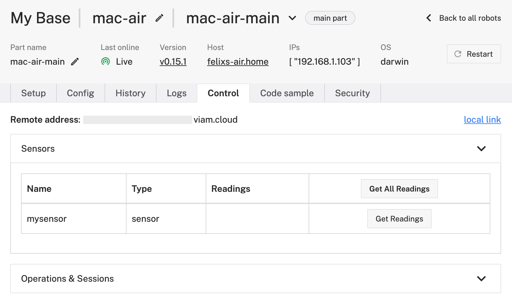

# My First Viam Component Using Go

This is a basic example / starter kit template helping you to learn and get started easily with integrating your particular hardware into the Viam ecosystem. This starter kit uses a sensor component to keep it simple but can also easily be used as foundation for any other component. All you have to do is to replace the sensor specific "Readings" method with the methods required by the component you intend to integrate. 

You can find further component APIs in the Viam documentation here: [Viam Component APIs](https://docs.viam.com/build/program/apis/#component-apis).

## Build the Module

From within the "src" directory run:

```go build -o ../bin/mysensor .```

## Add the Module (local deploy)

We are are going to keep it very simple and deploy Configure a local and will look into using the Viam Registry in in a later part. Deploying local module is straight forward through the web user interface directly or by adding directly to the RAW JSON configuration.

```
{
  "name": "a-module-name",
  "executable_path": "<-- Path to the sensor binary including the binary -->",
  "type": "local"
}
```

## Configure Component

Add this configuration to the smart machine "components" part either in RAW JSON mode or through the we user interface by choosing "local component" in the menu.

```
    {
      "name": "mysensor",
      "model": "viam-soleng:go-resources:gosensor",
      "type": "sensor",
      "namespace": "rdk",
      "attributes": {
        "setting": 2
      },
      "depends_on": []
    }
```

## Test the Component

The easiest way to test if the component was successfuly started, navigate to the "Control" tab, expand the Sensor section and hit the "Get Readings" button. 

If it doesn't appear, go and check the "Logs" tab where you will likely find good indication about what went wrong.




## BUILD INSTRUCTIONS MAC

To be able to successfully build the module, the following libraries are required.
I also uninstalled leptonica and tesseract with brew ignoring dependencies as mentioned here: https://github.com/otiai10/gosseract/issues/234#issuecomment-1707339205


wget http://www.leptonica.org/source/leptonica-1.78.0.tar.gz or https://github.com/DanBloomberg/leptonica/releases/tag/1.84.1
tar -xzvf leptonica-1.78.0.tar.gz
cd leptonica-1.78.0
./configure
make && sudo make install


brew install automake

git clone https://github.com/tesseract-ocr/tesseract.git
cd tesseract
./autogen.sh
./configure
make
sudo make install